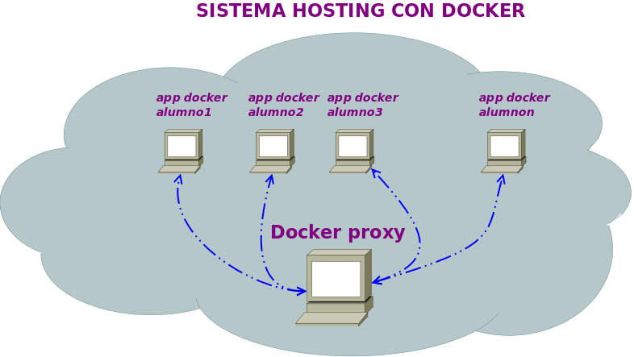

> Proyecto en desarrollo actualmente no funciona

# Crear un sistema docker para un grupo
Este ejercicio trata de crear un sistema dockerizado para que los alumnos puedan tener su propio sistema docker y tener un proxy escuchando por 80 o 443 y sepa resolver para cada alumno

## Estructura de carpetas
* Deberemos de tener un directorio por cada alumno (podrían ser los directorios que estuvieran en /home/alumnoxxx)
* Dentro de cada directorio, vamos a establecer una carpeta para la aplicación, y otra con el dockerfile de la declaracion de su entorno para su aplicación (se hará igual para todos en un principio. Este punto queda pendinte de ser más personalizado). En una primera versión podríamos dejar esta estrcutura:
* 